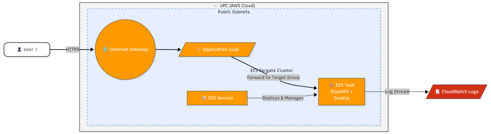

# Customer Churn FastAPI – AWS ECS Deployment (Terraform)


This project demonstrates an **end-to-end, production-grade cloud deployment** of a **Customer Churn Prediction system** using modern DevOps and MLOps practices.

It showcases how to **package a machine learning-powered FastAPI application**, deploy it on **AWS ECS (Fargate)** using **Terraform (IaC)**, expose it securely via an **Application Load Balancer (ALB)**, and operate it with **scalable, serverless infrastructure**—a setup commonly used in real-world enterprise environments.

---

## 🚀 Tech Stack

* **Backend**: FastAPI + Gradio
* **Containerization**: Docker
* **Cloud Provider**: AWS
* **Compute**: ECS (Fargate)
* **Networking**: VPC, Subnets, Internet Gateway
* **Load Balancer**: Application Load Balancer (ALB)
* **Logging**: CloudWatch Logs
* **IaC**: Terraform
* **CI/CD**: GitHub Actions

---

## 🏗 Architecture Overview

* VPC with public subnets (multi-AZ)
* Internet Gateway for public access
* Application Load Balancer (HTTP :80)
* Target Group (port 8000)
* ECS Cluster (Fargate)
* ECS Service + Task Definition
* IAM execution role for ECS tasks
* CloudWatch Log Group for container logs

---

## 🧩 Architecture Diagram

Below is the **actual deployed architecture** for this project, exported from Figma and stored in the repository.



📌 **Architecture Highlights**

* End users access the application via an **internet-facing Application Load Balancer (ALB)**
* ALB routes traffic to an **ECS Target Group**
* **ECS Service (Fargate)** runs containerized **FastAPI + Gradio** application
* Infrastructure runs inside a **custom VPC with public subnets across multiple AZs**
* **CloudWatch Logs** capture application and container logs

🎯 This architecture reflects a **real-world ML inference deployment pattern** used in production systems

---

## 📁 Project Structure

```
custmer_churn_ml_end_to_end_iac/
├── alb.tf               # ALB, listener, target group
├── ecs.tf               # ECS cluster, task definition, service
├── iam.tf               # IAM roles and policies
├── provider.tf          # AWS provider config
├── security.tf          # Security groups
├── vpc.tf               # VPC, subnets, IGW, route tables
├── variables.tf         # Input variables
├── outputs.tf           # Terraform outputs
├── dev.tfvars           # Environment values (not committed)
├── .gitignore
└── README.md
```

---

## 🐳 Docker Image

The ECS task uses the following Docker image:

```
lohitsasanapuri/telco-fastapi:latest
```

The FastAPI app listens on port **8000**.

---

## ⚙️ Prerequisites

* AWS account
* AWS CLI configured
* Terraform v1.5+
* Docker image already pushed to Docker Hub

---

## ✅ Deploy Infrastructure

```bash
terraform init
terraform plan 
terraform apply
```

After deployment, copy the **ALB DNS name** from Terraform output and open it in the browser.

---

## 🌐 Application Endpoints

* **Health Check**

  ```http
  GET /
  ```

* **Prediction API**

  ```http
  POST /predict
  ```

* **Gradio UI**

  ```
  /ui
  ```

---

## 🧨 Destroy Infrastructure

```bash
terraform destroy -var-file=dev.tfvars
```

---

## 🔁 CI/CD (GitHub Actions)

The project supports CI/CD using GitHub Actions to:

* Deploy infrastructure (Terraform apply)
* Destroy infrastructure (Terraform destroy)
* Authenticate securely using GitHub Secrets (no manual login)

---

## 🔐 Security Notes

* `*.tfvars` files are ignored from Git
* IAM follows least-privilege
* ECS tasks use execution role for logs and image pulls

---

## 📝 Notes

* ECS uses **Fargate**, no EC2 management required
* Logs available in CloudWatch
* ALB performs health checks on `/`

---

✅ Infrastructure is fully reproducible using Terraform
